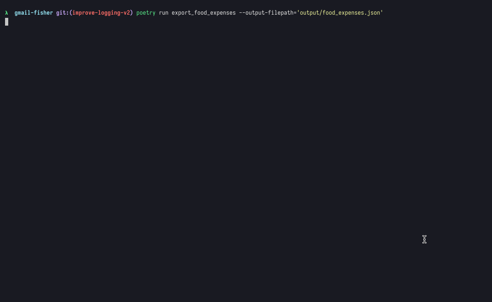

# Gmail Fisher


> Automation scripts for fetching email messages from Gmail API 🎣

Gmail Fisher allows you to query email messages that you have in your Gmail inbox.



Some of these automation tasks are used for fetching email receipts from certain purchases made online,
scrapping email subjects, bodies and attachments; and mapping them to Expense objects, to serialize them
into `.json` files.

Some existing adapters include fetching food expenses from UberEats or Bolt Food, or transportation
expenses from Uber and Bolt.

Follows an example of the JSON output for such expenses:

```json
[
    {
        "service": "Bolt Food",
        "restaurant": "Hello Beijing",
        "total_euros": 11.8,
        "date": "2023-02-14",
        "sender_email": "Bolt Food <portugal-food@bolt.eu>"
    },
    {
        "service": "Bolt Food",
        "restaurant": "Poke House",
        "total_euros": 14.29,
        "date": "2023-02-11",
        "sender_email": "Bolt Food <portugal-food@bolt.eu>"
    },
    {
        "service": "Bolt Food",
        "restaurant": "DOTE",
        "total_euros": 13.34,
        "date": "2023-02-08",
        "sender_email": "Bolt Food <portugal-food@bolt.eu>"
    }
]
```

## Getting Started

Go to [Google Cloud Platform console](https://console.cloud.google.com/apis/credentials), 
and under `APIs and services` > `Credentials`, create a new `OAuth 2.0 Client ID` credential.

Under `Actions`, click `Download OAuth client` and then `Download Json`.

Rename downloaded file to `credentials.json` and place it under the `auth` folder.

## Run Scripts

### Export Food Expenses to JSON

Filters available messages with Uber Eats and Bolt Food expenses.

Scraps data from those messages to populate a `FoodExpense` iterable that will then be serialized to a Json file.

Example:
```bash
poetry run export_food_expenses --output-filepath='output/food_expenses.json'
```

### Export Transportation Expenses to JSON

Filters available messages with Bolt expenses.

Scraps data from those messages to populate a `BoltTransportationExpense` iterable that will then be serialized to a Json file.

Example:
```bash
poetry run export_transport_expenses --output-filepath='output/transport_expenses.json'
```

### List Messages

Filters available messages with `KEYWORDS` and from `SENDER_EMAILS` and lists them.

Example:
```bash
poetry run list_messages --sender-email='portugal-food@bolt.eu' --keywords='Delivery'
```

### Save Attachments

Filters available messages with `KEYWORDS` and from `SENDER_EMAILS` and lists them.

If filtered messages contain attachments, then those will be downloaded
to an `output` directory and with a formatted name of `PaySlip_YYYY-MM.pdf`.

Example:
```bash
poetry run save_attachments --sender-email='me@my-company.com|payroll@my-company.com' --keywords='payslip'
```