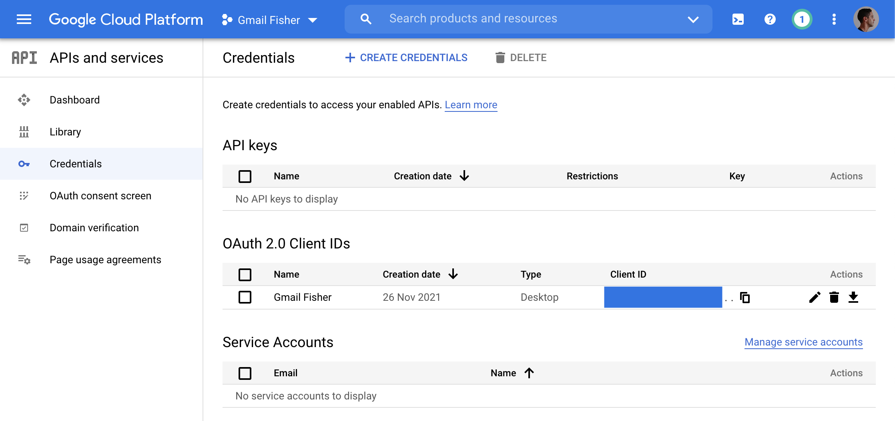

# Gmail Fisher


Automation scripts for interacting with Gmail API 🎣

## Getting Started

Go to https://console.cloud.google.com/apis/credentials and create `Oauth client ID` credentials:



Under `Actions`, click `Download OAuth client` and then `Download Json`.

Rename downloaded file to `credentials.json` and place it under the `auth` folder. 

## Run Server

Start REST server by running the command:

```bash
poetry run uvicorn gmail_fisher.main:app --reload
```

Then make a `GET` request to `/expenses/food`:

```bash
http GET localhost:8000/expenses/food
```

## Run Scripts

### List Messages

Filters available messages with `KEYWORDS` and from `SENDER_EMAILS` and lists them.

Example:
```bash
poetry run list_messages --sender-email='portugal-food@bolt.eu' --keywords='Delivery'
```

### Save Attachments

Filters available messages with `KEYWORDS` and from `SENDER_EMAILS` and lists them.

If filtered messages contain attachments, then those will be downloaded
to an `output` directory and with a formatted name of `PaySlip_YYYY-MM.pdf`.

Example:
```bash
poetry run save_attachments --sender-email='me@my-company.com|payroll@my-company.com' --keywords='payslip'
```

### Export Food Expenses to JSON

Filters available messages with Uber Eats and Bolt Food expenses.

Scraps data from those messages to populate a `FoodExpense` iterable that will then be serialized to a Json file.

Example:
```bash
poetry run export_food_expenses --output-filepath='output/food_expenses.json'
```

### Export Transportation Expenses to JSON

Filters available messages with Bolt expenses.

Scraps data from those messages to populate a `BoltTransportationExpense` iterable that will then be serialized to a Json file.

Example:
```bash
poetry run export_transport_expenses --output-filepath='output/transport_expenses.json'
```